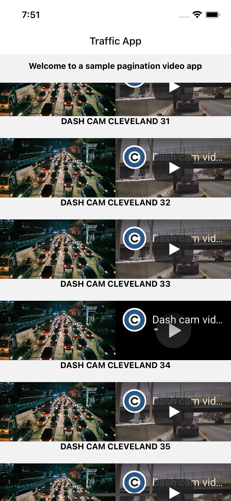

# React Native flow pagination example

<!--  -->

**Main stack: react native, flow, styled-components**

1. **Fetches url from a remote url**

2. **Shallow clones data using the spread syntax let shallowClone = [...result]**

3. **Maps through the shallow Clone array objects and adds a video url, and record time inside of each array of the cloned array**

4. **Paginates data with concat + page number**

5. **data source https://jsonplaceholder.typicode.com/photos?_limit=10&_page=**
